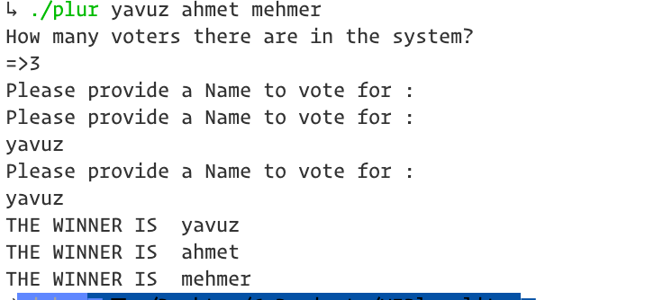
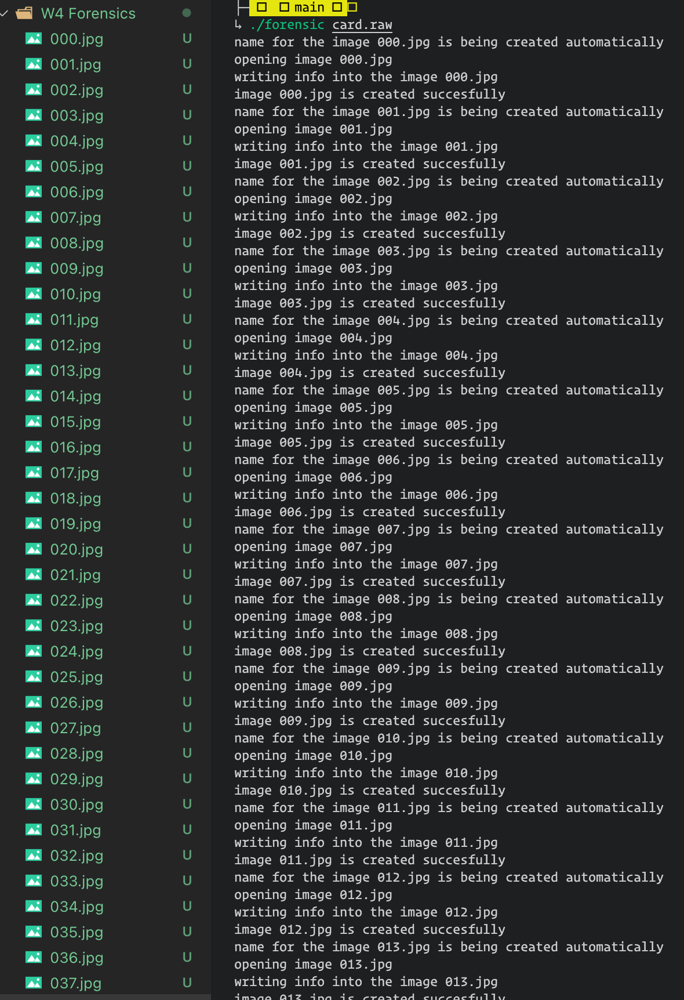
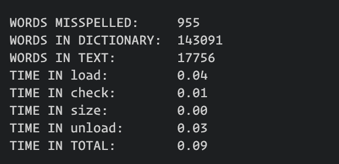

# Weekly Assignments of Harvard's CS50
## DISCLAIMER:
### I opted for MVP, Once a code is working as it should, I did not deal with refactoring or rewriting some elements in order to achieve elegancy since the trade-off meta, time, is more valuable now my case.!
   
### Thus, these codes should be considered as beta versions, not necessarily display the quality of possible final product!. 

   

## 1) Mario:

## 2) Caesar:

## 3) Text Readability Algorithm.

## Another Screensot for Readability.
   

## 4) Plurality - A basic Voting system

   
## 5) Filtering
   

#### Original Picture

#### a) filter- Greyscale
   

   
#### b) filter- Sepia

   
#### c) filter- Reverse

   

## 5) Recover Data from Forensic Image
   

#### Original Picture

## FINALLY!!

## 6) SPELLER

   

When N=26 in Linked List Bucket size

When N = 2000000 in linked list bucket Size
   

