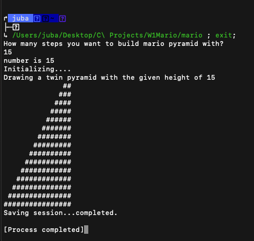
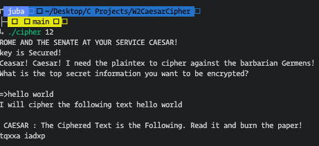
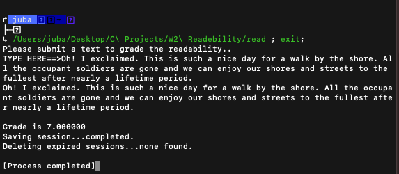
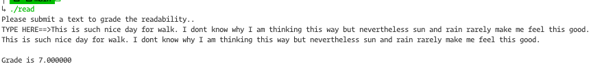

# Weekly Assignments of Harvard's CS50
## DISCLAIMER:
### I opted for MVP, Once a code is working as it should, I did not deal with refactoring or rewriting some elements in order to achieve elegancy since the trade-off meta, time, is more valuable now my case.!
   
### Thus, these codes should be considered as beta versions, not necessarily display the quality of possible final product!. 

   

## 1) Mario:

## 2) Caesar:

## 3) Text Readability Algorithm.

## Another Screensot for Readability.
   

